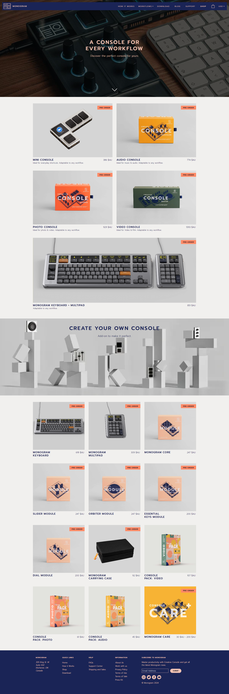

# Monogram Webpage Clone

The monogram webpage clone is a solution for the [Frontend practice](https://www.frontendpractice.com/projects/monogram) challenge.

### [Demo Link](https://monogram-webpage-clone.vercel.app/)

## Screenshots

### Mobile


### Tablets


### Desktop



## Built with

- Semantic HTML5 markup
- SASS
- CSS custom properties
- Flexbox
- CSS Grid
- Mobile-first workflow
- [Vite Js](https://vitejs.dev/) Javascript Bundler.
- [PNPM](https://pnpm.io/) Package Manager.
- [React Js](https://react.dev/) UI Library.
- [Typescript](https://www.typescriptlang.org/) a strongly typed programming language that builds on top of JavaScript, giving you better tooling for errors.

## How To Use This Repos

To clone and run this application, you'll need [Git](https://git-scm.com) and [PNPM](http://pnpm.io/) installed on your computer. From your command line:

```zsh
# Clone this repository
$ git clone https://github.com/SouleymaneSy7/monogram-webpage-clone

# Install dependencies
$ pnpm install

# start the server
$ pnpm dev
```

## Author

- GitHub - [Souleymane Sy](https://github.com/SouleymaneSy7)
- Frontend Mentor - [@SouleymaneSy7](https://www.frontendmentor.io/profile/SouleymaneSy7)
- Dev Challenges - [Souleymane Sy](https://devchallenges.io/profile/534cd213-3165-4c16-bdcf-058e1f468da0)
- Twitter - [@Souleymanesy43](https://twitter.com/Souleymanesy43)
